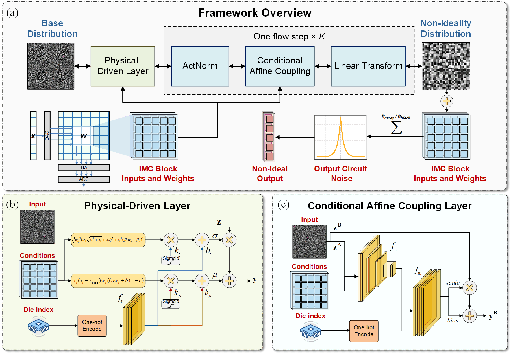

# PDGM-IMC: Physics & Data Co-Driven Generative Modeling for In-Memory Computing Non-Idealities


## 📖 Overview
**PDGM-IMC** is the first **physics-data co-driven generative framework** for accurately characterizing non-idealities in **analog in-memory computing (IMC)** chips.  
It integrates **device-physics priors** into a **Normalizing Flow**-based generative model, enabling the explicit modeling of:
- Complex probability distributions  
- Spatial correlations  
- Die-to-die variations  

Validated on a commercial 40nm eFlash-based IMC SoC, PDGM-IMC achieves up to **4.6× improvement** in modeling accuracy for the input circuit and IMC array, and **2.0× improvement** for the output circuit, significantly outperforming existing approaches.

This work has been accepted by **The 2025 International Conference on Computer-Aided Design (ICCAD 2025)**.

The dataset of the paper cannot be made publicly available at the moment due to involving the commercial secrets of our collaborating partners. We are working hard to release a de-identified dataset in our future work. We sincerely apologize for the inconvenience.



---

## ✨ Key Features
- **Physics + Data Synergy**  
  Combines the interpretability of physics-based modeling with the flexibility of data-driven learning.
- **Generative Modeling**  
  Supports noise sampling for hardware-aware neural network optimization.
- **Explicit Probability Density Estimation**  
  Enables design of targeted non-ideality mitigation strategies.
- **Commercial Chip Validation**  
  Evaluated on real CNN, RNN, and Transformer workloads.
- **Extensibility**  
  Adaptable to multiple memory device types (eFlash, RRAM, etc.).

---

## ⚙️ Requirements
- Python 3.8+
- [PyTorch](https://pytorch.org/) >= 1.9
- [nflows](https://github.com/bayesiains/nflows)
- NumPy, SciPy, Matplotlib
- CUDA (recommended for training acceleration)

Install dependencies:
```bash
pip install -r requirements.txt
```
## 📊 Experimental Highlights

- **For Input Circuit & IMC Array**:  KL divergence reduced by 4.87×, NLL improved by 2.10×

- **For Output Circuit**:  Laplace distribution outperforms Gaussian for high-kurtosis noise, reducing KL by 1.96×

- Captures **spatial correlations**, **conditional dependencies on weights/inputs**, and **die-to-die variations** that previous methods could not model effectively.

## 📄 License
This project is released under the **MIT License**.